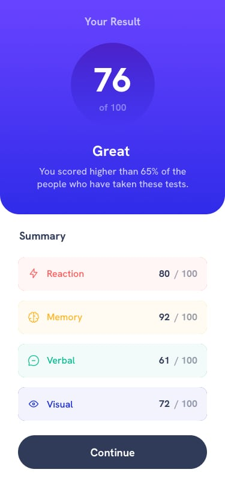

# Result Summary Component - Frontend Mentor Challenge

## 🚀 Project Design




## 🚀 Project Structure

Inside of this project, you'll see the following folders and files:

```
/
├── public/
├── src/
│   └── components/
│       └── Overview.astro
│       └── Summary.astro
│   └── data/
│       └── data.json
│   └── pages/
│       └── index.astro
│   └── styles/
│       └── main.css
│
└── package.json
```


## 🧞 Commands

All commands are run from the root of the project, from a terminal:

| Command                | Action                                           |
| :--------------------- | :----------------------------------------------- |
| `npm install`          | Installs dependencies                            |
| `npm run dev`          | Starts local dev server at `localhost:3000`      |
| `npm run build`        | Build your production site to `./dist/`          |
| `npm run preview`      | Preview your build locally, before deploying     |


